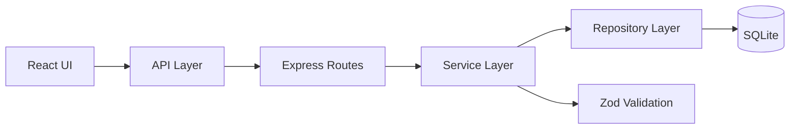
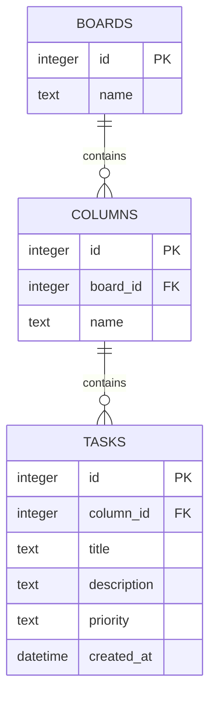

<div align="center">

# TaskFlow

### A lightweight full-stack task management board built as a take-home assignment.

**React · Vite · Node.js · Express · SQLite · REST API · Native Drag & Drop**

<br />

<a href="https://taskflow-e5i9.onrender.com/">
  
</a>
&nbsp;
<a href="https://github.com/Mohd-Ashad04/taskflow">
  
</a>
&nbsp;


<br />
<br />

**[Open the live application →](https://taskflow-e5i9.onrender.com/)**

</div>

---

## What I Built

TaskFlow is a small full-stack task management application designed around a simple workflow:

```text
Create → Prioritize → Organize → Move → Complete
```

The application provides a persistent task board where users can:

- Create tasks
- Edit tasks
- Delete tasks
- Assign priorities
- Filter by priority
- Move tasks between columns
- Drag and drop tasks
- Rename the board
- Refresh the page without losing persisted data

The application is backed by a real SQLite database and a REST API rather than browser-only state.

### The important part

I intentionally kept the implementation within the assignment's scope instead of adding unrelated features.

The project focuses on:

> **Correctness → Database integrity → Validation → Error handling → Testability → Maintainability**

---

# Live Demo

| | |
|---|---|
| **Application** | **[https://taskflow-e5i9.onrender.com/](https://taskflow-e5i9.onrender.com/)** |
| **Live API** | **[https://taskflow-e5i9.onrender.com/api/boards/1](https://taskflow-e5i9.onrender.com/api/boards/1)** |
| **GitHub** | **[https://github.com/Mohd-Ashad04/taskflow](https://github.com/Mohd-Ashad04/taskflow)** |

The production deployment uses a single Node.js/Express service to serve both:

```text
React SPA
   +
REST API
   +
SQLite persistence
```

---

# Feature Overview

| Feature | Status |
|---|:---:|
| Board with columns and tasks | ✅ |
| Create task | ✅ |
| Edit task | ✅ |
| Delete task | ✅ |
| Task priority | ✅ |
| Priority filtering | ✅ |
| Move task | ✅ |
| Board rename | ✅ |
| Persistent SQLite storage | ✅ |
| Backend validation | ✅ |
| API error handling | ✅ |
| Frontend error feedback | ✅ |
| Responsive UI | ✅ |
| Native drag-and-drop | ✅ |
| Production deployment | ✅ |
| Automated backend tests | ✅ |

---

# Assignment Scope

The assignment explicitly prioritizes a **working core over feature volume**.

TaskFlow follows that principle.

### Core functionality

```text
Board
 ├── Columns
 │    └── Tasks
 │         ├── Create
 │         ├── Edit
 │         ├── Delete
 │         ├── Priority
 │         └── Move
 │
 └── Board Rename
```

### Selected stretch goal

The assignment allows **at most one** stretch goal.

I selected:

> **Native HTML5 drag-and-drop**

I deliberately did **not** implement task-title search or task-count display as user-facing stretch goals.

The standard movement dropdown remains available as an accessible fallback.

---

# How It Works



A typical task mutation follows:

```text
User Action
    ↓
React Component
    ↓
API Request
    ↓
Express Route
    ↓
Service
    ↓
Validation / Business Rules
    ↓
Repository
    ↓
SQLite
    ↓
API Response
    ↓
UI Update
```

This keeps HTTP handling, business logic, persistence, and presentation concerns separate.

---

# Architecture

TaskFlow uses a deliberately small modular architecture.

It is not a large enterprise architecture for a small assignment.

The goal was to create enough separation that another developer can understand and modify the system without having to trace business logic through a single large file.

## Backend Responsibilities

### Routes

Responsible for:

- HTTP methods
- Route parameters
- Request/response handling
- Delegating work to services

### Services

Responsible for:

- Validation
- Business rules
- Resource existence checks
- Coordinating repository operations

### Repositories

Responsible for:

- SQL
- Database reads
- Database writes
- Database-specific operations

### Database

Responsible for:

- Persistence
- Relationships
- Constraints
- Referential integrity

---

# Project Structure

```text
taskflow/
│
├── client/
│   ├── public/
│   ├── src/
│   │   ├── api/
│   │   │   └── taskflowApi.js
│   │   │
│   │   ├── components/
│   │   │   ├── BoardHeader.jsx
│   │   │   ├── ConfirmDialog.jsx
│   │   │   ├── Feedback.jsx
│   │   │   ├── LoadingBoard.jsx
│   │   │   ├── TaskCard.jsx
│   │   │   ├── TaskColumn.jsx
│   │   │   └── TaskFormDialog.jsx
│   │   │
│   │   ├── hooks/
│   │   │   └── useBoard.js
│   │   │
│   │   ├── styles/
│   │   │   └── taskflow.css
│   │   │
│   │   ├── App.jsx
│   │   ├── index.css
│   │   └── main.jsx
│   │
│   └── package.json
│
├── server/
│   ├── src/
│   │   ├── db/
│   │   │   ├── database.js
│   │   │   ├── schema.sql
│   │   │   └── seed.js
│   │   │
│   │   ├── repositories/
│   │   │   ├── boardRepository.js
│   │   │   └── taskRepository.js
│   │   │
│   │   ├── routes/
│   │   │   ├── boardRoutes.js
│   │   │   └── taskRoutes.js
│   │   │
│   │   ├── services/
│   │   │   ├── boardService.js
│   │   │   ├── errors.js
│   │   │   └── taskService.js
│   │   │
│   │   ├── app.js
│   │   └── server.js
│   │
│   ├── tests/
│   │   ├── api.test.js
│   │   └── taskRepository.test.js
│   │
│   └── package.json
│
├── .gitignore
├── package.json
└── README.md
```

---

# Database Design

The database follows the domain naturally:



## Relationships

```text
Board
  │
  ├── Column
  │     ├── Task
  │     ├── Task
  │     └── Task
  │
  ├── Column
  │     └── Task
  │
  └── Column
        └── Task
```

## Integrity Rules

The schema enforces:

- Primary keys
- Foreign keys
- Required fields
- Controlled priority values
- Referential integrity
- Cascading deletes where applicable

SQLite foreign-key enforcement is explicitly enabled when the database connection is initialized.

---

# SQL Implementation

One of the assignment requirements was to demonstrate meaningful database querying rather than retrieving everything and filtering it in application code.

TaskFlow performs the required operations directly in SQLite.

## Query 1 — Task Count Per Column

```sql
SELECT
  columns.id AS columnId,
  columns.name AS columnName,
  COUNT(tasks.id) AS taskCount
FROM columns
LEFT JOIN tasks
  ON tasks.column_id = columns.id
WHERE columns.board_id = ?
GROUP BY columns.id, columns.name
ORDER BY columns.id;
```

The aggregation is performed by the database.

## Query 2 — Priority-Filtered Tasks

```sql
SELECT
  tasks.id,
  tasks.column_id AS columnId,
  tasks.title,
  tasks.description,
  tasks.priority,
  tasks.created_at AS createdAt
FROM tasks
INNER JOIN columns
  ON columns.id = tasks.column_id
WHERE columns.board_id = ?
  AND tasks.priority = ?
ORDER BY tasks.created_at DESC, tasks.id DESC;
```

Filtering and ordering are performed directly by SQLite.

This avoids fetching unnecessary records and filtering the entire dataset in JavaScript.

---

# REST API

| Method | Endpoint | Purpose |
|---|---|---|
| `GET` | `/api/boards/:boardId` | Retrieve board, columns and tasks |
| `GET` | `/api/boards/:boardId/tasks?priority=...` | Retrieve filtered tasks |
| `POST` | `/api/boards/:boardId/tasks` | Create a task |
| `PATCH` | `/api/boards/:boardId` | Rename a board |
| `PATCH` | `/api/tasks/:taskId` | Edit a task |
| `PATCH` | `/api/tasks/:taskId/move` | Move a task |
| `DELETE` | `/api/tasks/:taskId` | Delete a task |

---

## Example API Request

### Rename Board

```http
PATCH /api/boards/1
Content-Type: application/json

{
  "name": "Product Launch"
}
```

The updated name is persisted to SQLite.

Refreshing the application retrieves the updated value from the database.

---

# Validation

Validation is performed on the backend using Zod.

This means invalid requests cannot bypass application rules simply by calling the API directly.

For example:

```json
{
  "title": "   "
}
```

is rejected because the title contains no meaningful content.

The same principle is applied to board names.

---

# Error Handling

The API uses controlled error responses.

| Scenario | HTTP Status |
|---|---:|
| Invalid request | `400` |
| Resource not found | `404` |
| Unexpected server error | `500` |

Example:

```json
{
  "error": {
    "code": "NOT_FOUND",
    "message": "Route not found."
  }
}
```

The frontend also provides visible feedback when mutations fail instead of silently leaving the UI in an inconsistent state.

---

# Testing

The backend is tested using isolated SQLite databases.

### Current Verification

```text
Backend tests      13 / 13 PASS
Client lint        PASS
Production build   PASS
```

## Backend Tests

The test suite covers:

- Task creation
- Task validation
- Task editing
- Task deletion
- Task movement
- Board rename
- Missing resources
- Invalid input
- API error handling
- Repository operations
- SQL/database behavior

## Test Isolation

Repository tests use:

```text
SQLite :memory:
```

This prevents tests from depending on the development database.

```text
Test Case
    │
    ▼
Fresh SQLite :memory:
    │
    ├── Schema
    ├── Test Data
    └── Operation
    │
    ▼
Assertion
    │
    ▼
Database discarded
```

This makes database tests isolated and repeatable.

---

# Local Setup

The project is designed to work from a clean clone without requiring a separately managed database.

## Requirements

- Node.js 20+
- npm

## 1. Clone

```bash
git clone https://github.com/Mohd-Ashad04/taskflow.git
cd taskflow
```

## 2. Install Dependencies

```bash
npm ci --prefix server
npm ci --prefix client
```

## 3. Seed the Database

```bash
cd server
node src/db/seed.js
```

The seed script creates the deterministic initial board, columns, and sample tasks.

---

# Run the Tests

From the `server` directory:

```bash
npm test
```

Then from the `client` directory:

```bash
cd ../client
npm run lint
```

---

# Development Mode

Run backend and frontend separately.

### Terminal 1 — Backend

```bash
cd server
npm start
```

Backend:

```text
http://localhost:3000
```

### Terminal 2 — Frontend

```bash
cd client
npm run dev
```

Frontend:

```text
http://localhost:5173
```

Vite handles the frontend development server while Express handles the REST API.

---

# Production Mode

The production application uses a single Express process.

## Build

```bash
cd client
npm run build
```

## Start

```bash
cd ../server
npm start
```

Open:

```text
http://localhost:3000
```

The Express server serves:

```text
/api/*       → REST API
/assets/*    → Compiled React assets
/            → React application
```

---

# Deployment

TaskFlow is deployed as a Render Web Service.

```text
                    Render
                      │
                      ▼
               Node.js / Express
                  ┌────┴────┐
                  │         │
                  ▼         ▼
              REST API   React SPA
                  │         │
                  └────┬────┘
                       ▼
                    SQLite
```

The server uses:

```javascript
process.env.PORT
```

so the hosting platform can provide the runtime port.

### Live Application

**https://taskflow-e5i9.onrender.com/**

### Live API

**https://taskflow-e5i9.onrender.com/api/boards/1**

---

# Engineering Decisions

## Why SQLite?

SQLite was selected because the assignment permits it and it requires no separately managed database server.

This provides:

- Real relational persistence
- Foreign keys
- SQL queries
- Constraints
- Simple local setup

For a larger production system with multiple application instances, higher concurrency, or managed backups, PostgreSQL would be a natural next step.

---

## Why Raw SQL?

The assignment specifically evaluates database design and SQL.

For that reason, SQL is kept explicitly inside the repository layer rather than being hidden behind an ORM.

```text
Service
   ↓
Repository
   ↓
SQL
   ↓
SQLite
```

This also makes the required SQL operations easy to inspect and test.

---

## Why a Service / Repository Structure?

The application is intentionally small, so a full enterprise architecture would add unnecessary complexity.

The current separation provides a practical balance:

```text
Routes
  ↓
Services
  ↓
Repositories
  ↓
Database
```

Each layer has a clear responsibility without excessive abstraction.

---

## Why Native Drag-and-Drop?

The assignment allowed one stretch goal.

I selected native HTML5 drag-and-drop because it adds useful interaction without introducing another dependency.

The existing dropdown movement control remains available as an accessible fallback.

---

# Scope & Assumptions

## Single Default Board

The application operates on Board `1`.

Authentication, multiple users, teams, and board switching were intentionally excluded because they were outside the assignment scope.

## Task Movement

A task belongs to one column at a time.

Moving a task updates its `column_id` in SQLite.

## Priority

Supported priorities:

```text
low
medium
high
```

## Stretch Goal

Only one stretch goal was implemented:

> **Native HTML5 drag-and-drop**

The following were intentionally not implemented as stretch goals:

- Task title search
- Task-count display

This keeps the implementation aligned with the assignment's explicit scope limit.

---

# Assignment Requirement Mapping

The implementation maps directly to the requested evaluation areas.

| Assignment Evaluation Area | TaskFlow |
|---|:---:|
| Working board | ✅ |
| Create task | ✅ |
| Edit task | ✅ |
| Delete task | ✅ |
| Move task | ✅ |
| Persistent data | ✅ |
| Relational database | ✅ |
| Sensible schema | ✅ |
| Primary keys | ✅ |
| Foreign keys | ✅ |
| Required constraints | ✅ |
| Database-level queries | ✅ |
| Priority filtering | ✅ |
| Validation | ✅ |
| Error handling | ✅ |
| Database tests | ✅ |
| API tests | ✅ |
| Clean setup instructions | ✅ |
| One stretch goal | Drag & Drop |
| Live deployment | ✅ |

---

# What I Would Improve With More Time

The current implementation intentionally stays within the assignment scope.

If TaskFlow were developed beyond the take-home assignment, I would consider:

### Managed PostgreSQL

For:

- Higher concurrency
- Managed backups
- Horizontal scaling
- Production database operations

### End-to-End Browser Testing

Add Playwright tests covering the complete workflow:

```text
Create
  ↓
Edit
  ↓
Move
  ↓
Filter
  ↓
Rename
  ↓
Refresh
  ↓
Verify persistence
```

### Multiple Boards

Add board creation and board selection if the application evolves beyond a single-board workflow.

### Authentication

Introduce authentication and authorization if the application becomes multi-user.

These are future product extensions, not unfinished assignment requirements.

---

# What I Learned

## Express SPA Middleware Ordering

Serving a Vite-generated React application from Express requires careful middleware ordering.

API routes need to be handled before the SPA fallback.

Otherwise:

```text
/api/missing
```

could incorrectly receive:

```text
index.html
```

instead of a JSON `404`.

The final middleware flow is therefore:

```text
API Routes
   ↓
API 404 Handler
   ↓
Static Assets
   ↓
React index.html Fallback
```

---

## SQLite Foreign Keys

SQLite does not automatically enforce foreign keys for every connection.

The application explicitly enables them when creating the database connection.

```sql
PRAGMA foreign_keys = ON;
```

This ensures invalid relationships cannot silently enter the database.

---

## Repository-Level Testing

Keeping SQL operations inside repository modules makes it possible to inject isolated:

```text
:memory:
```

SQLite databases into tests.

That allows database behavior to be tested without depending on the application's persistent database.

---
# Final Project Snapshot

```text
Frontend
React + Vite
      │
      ▼
REST API
Node.js + Express
      │
      ▼
Business Logic
Services + Zod
      │
      ▼
Persistence
Repositories + SQL
      │
      ▼
SQLite
```

### Verification

```text
✓ Core requirements implemented
✓ One stretch goal implemented
✓ Real database persistence
✓ Backend validation
✓ Structured error handling
✓ 13/13 backend tests passing
✓ Client lint passing
✓ Production build passing
✓ Live deployment available
```

---

# Repository & Demo

### Source Code

**https://github.com/Mohd-Ashad04/taskflow**

### Live Application

**https://taskflow-e5i9.onrender.com/**

### Live API

**https://taskflow-e5i9.onrender.com/api/boards/1**

<div align="center">

## Built by Mohd Ashad

**Backend / Full-Stack Developer**

[GitHub](https://github.com/Mohd-Ashad04) ·

</div>
