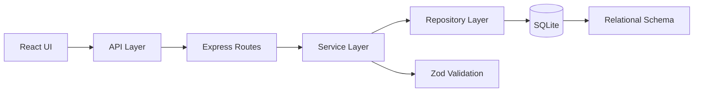

<div align="center">

# TaskFlow

### A production-minded full-stack task board built for the TaskFlow assignment.

**React · Node.js · Express · SQLite · REST API · Native Drag & Drop**

<br />

[](https://taskflow-e5i9.onrender.com/)
[](https://github.com/Mohd-Ashad04/taskflow)
[](https://github.com/Mohd-Ashad04/taskflow)
[](LICENSE)

<br />

**[Open the Live Application →](https://taskflow-e5i9.onrender.com/)**

</div>

---

## What is TaskFlow?

TaskFlow is a lightweight task-management board designed around the core workflow of a small team:

**Create → Organize → Prioritize → Move → Complete**

The application provides a persistent board with columns and tasks, backed by a real relational SQLite database and a REST API.

The implementation intentionally focuses on the fundamentals that matter in a real full-stack application:

- reliable CRUD operations
- server-side validation
- relational database integrity
- clear separation of responsibilities
- persistence across page reloads
- controlled API errors
- accessible task movement fallback
- automated backend testing
- production-style frontend serving

The project deliberately avoids unnecessary product complexity such as authentication, multi-user collaboration, file uploads, or realtime synchronization because those features were explicitly outside the assignment scope.

---

## Live Demo

<table>
<tr>
<td><strong>Application</strong></td>
<td><a href="https://taskflow-e5i9.onrender.com/">https://taskflow-e5i9.onrender.com/</a></td>
</tr>
<tr>
<td><strong>Board API</strong></td>
<td><a href="https://taskflow-e5i9.onrender.com/api/boards/1">GET /api/boards/1</a></td>
</tr>
<tr>
<td><strong>Source Code</strong></td>
<td><a href="https://github.com/Mohd-Ashad04/taskflow">github.com/Mohd-Ashad04/taskflow</a></td>
</tr>
</table>

> The live application is deployed as a single Node.js/Express service that serves both the compiled React frontend and REST API.

---

## Product Overview

```text
                         TASKFLOW
                            │
             ┌──────────────┴──────────────┐
             │                             │
        Task Management               Board Management
             │                             │
     ┌───────┼────────┐                    │
     │       │        │                    │
   Create   Edit    Delete             Rename Board
     │       │        │
     └───────┼────────┘
             │
      ┌──────┴──────┐
      │             │
   Priority      Movement
   Filtering     ┌───────┐
                 │       │
              Dropdown  Drag & Drop
```

---

# Features

| Capability | Implementation |
|---|---|
| Board | Persistent board with multiple columns |
| Create Task | Required title, optional description and priority |
| Edit Task | Update title, description and priority |
| Delete Task | Persistent deletion through the API |
| Move Task | Dropdown fallback + native HTML5 drag-and-drop |
| Priority Filter | Filter visible tasks by Low / Medium / High |
| Board Rename | Persisted board-name update through REST API |
| Validation | Zod validation on the backend |
| Error Handling | Structured API errors + visible UI feedback |
| Database | SQLite with foreign-key enforcement |
| Testing | 13 backend tests |
| Production Serving | Express serves API + compiled React SPA |
| Responsive UI | Board adapts to smaller screens |

---

# Core Workflow

### 1. Create

Create a task with:

- title
- description
- priority
- destination column

The backend rejects empty or whitespace-only titles.

### 2. Organize

Tasks can be moved between:

- To Do
- In Progress
- Done

Movement is persisted to SQLite.

### 3. Prioritize

Use the priority filter to focus the board on:

- High
- Medium
- Low

### 4. Edit

Existing tasks can be updated without recreating them.

### 5. Complete

Move tasks into the Done column using either:

- native drag-and-drop
- accessible dropdown control

The dropdown remains intentionally available as a fallback rather than making drag-and-drop the only way to move a task.

---

# Architecture

TaskFlow uses a small modular structure rather than introducing unnecessary framework complexity.



### Request flow

```text
Browser
   │
   ▼
React Components
   │
   ▼
API Functions
   │
   ▼
Express Router
   │
   ▼
Service Layer
   │
   ├── Validation
   ├── Business Rules
   └── Resource Checks
   │
   ▼
Repository Layer
   │
   ▼
SQLite
```

This keeps HTTP concerns, business logic, persistence, and UI concerns separated without introducing an unnecessarily large architecture.

---

# Project Structure

```text
taskflow/
│
├── client/
│   ├── public/
│   ├── src/
│   │   ├── api/
│   │   │   └── taskflowApi.js
│   │   ├── components/
│   │   │   ├── BoardHeader.jsx
│   │   │   ├── ConfirmDialog.jsx
│   │   │   ├── Feedback.jsx
│   │   │   ├── LoadingBoard.jsx
│   │   │   ├── TaskCard.jsx
│   │   │   ├── TaskColumn.jsx
│   │   │   └── TaskFormDialog.jsx
│   │   ├── hooks/
│   │   │   └── useBoard.js
│   │   ├── styles/
│   │   │   └── taskflow.css
│   │   ├── App.jsx
│   │   ├── index.css
│   │   └── main.jsx
│   ├── package.json
│   └── vite.config.js
│
├── server/
│   ├── src/
│   │   ├── db/
│   │   │   ├── database.js
│   │   │   ├── schema.sql
│   │   │   └── seed.js
│   │   ├── repositories/
│   │   │   ├── boardRepository.js
│   │   │   └── taskRepository.js
│   │   ├── routes/
│   │   │   ├── boardRoutes.js
│   │   │   └── taskRoutes.js
│   │   ├── services/
│   │   │   ├── boardService.js
│   │   │   ├── errors.js
│   │   │   └── taskService.js
│   │   ├── app.js
│   │   └── server.js
│   ├── tests/
│   │   ├── api.test.js
│   │   └── taskRepository.test.js
│   └── package.json
│
├── .gitignore
├── package.json
└── README.md
```

---

# Technology Stack

### Frontend

- React
- Vite
- JavaScript
- Native HTML5 Drag & Drop
- CSS

### Backend

- Node.js
- Express
- REST API
- Zod

### Database

- SQLite
- better-sqlite3
- Raw SQL
- Foreign-key constraints

### Testing

- Node.js native test runner
- Supertest
- In-memory SQLite databases
- ESLint
- Vite production build

---

# Database Design

The application uses a relational model:

```text
┌──────────────┐
│    boards    │
├──────────────┤
│ id           │ PK
│ name         │
└──────┬───────┘
       │
       │ 1:N
       ▼
┌──────────────┐
│   columns    │
├──────────────┤
│ id           │ PK
│ board_id     │ FK
│ name         │
└──────┬───────┘
       │
       │ 1:N
       ▼
┌──────────────┐
│    tasks     │
├──────────────┤
│ id           │ PK
│ column_id    │ FK
│ title        │ NOT NULL
│ description  │
│ priority     │
│ created_at   │
└──────────────┘
```

### Integrity rules

The schema enforces:

- primary keys on every table
- foreign key `columns.board_id → boards.id`
- foreign key `tasks.column_id → columns.id`
- required task titles
- required board names
- controlled priority values
- cascading deletes where appropriate
- SQLite foreign-key enforcement

---

# Database Queries

The assignment specifically asked for queries beyond simple `SELECT *`.

TaskFlow includes dedicated repository-level SQL for operations such as task aggregation and priority filtering.

## Task count per column

```sql
SELECT
  columns.id AS columnId,
  columns.name AS columnName,
  COUNT(tasks.id) AS taskCount
FROM columns
LEFT JOIN tasks
  ON tasks.column_id = columns.id
WHERE columns.board_id = ?
GROUP BY columns.id, columns.name
ORDER BY columns.id;
```

This calculates task counts directly in the database rather than fetching every task and counting them in JavaScript.

## Priority-filtered tasks

```sql
SELECT
  tasks.id,
  tasks.column_id AS columnId,
  tasks.title,
  tasks.description,
  tasks.priority,
  tasks.created_at AS createdAt
FROM tasks
INNER JOIN columns
  ON columns.id = tasks.column_id
WHERE columns.board_id = ?
  AND tasks.priority = ?
ORDER BY tasks.created_at DESC, tasks.id DESC;
```

The filtering and ordering are performed by SQLite.

---

# API

The backend exposes a small REST API.

| Method | Endpoint | Purpose |
|---|---|---|
| `GET` | `/api/boards/:boardId` | Retrieve board, columns and tasks |
| `GET` | `/api/boards/:boardId/tasks?priority=...` | Retrieve filtered tasks |
| `POST` | `/api/boards/:boardId/tasks` | Create a task |
| `PATCH` | `/api/boards/:boardId` | Rename a board |
| `PATCH` | `/api/tasks/:taskId` | Edit a task |
| `PATCH` | `/api/tasks/:taskId/move` | Move a task |
| `DELETE` | `/api/tasks/:taskId` | Delete a task |

### Example

```http
PATCH /api/boards/1
Content-Type: application/json

{
  "name": "Product Launch"
}
```

Response:

```json
{
  "board": {
    "id": 1,
    "name": "Product Launch"
  }
}
```

---

# Validation & Error Handling

Validation is performed on the backend rather than relying only on browser-side controls.

### Examples

Invalid task:

```json
{
  "title": "   "
}
```

→ `400 Bad Request`

Non-existent resource:

```text
GET /api/boards/9999
```

→ `404 Not Found`

Unexpected server failure:

→ `500 Internal Server Error`

The frontend converts failed API operations into visible feedback instead of exposing raw backend errors or leaving the UI in a broken state.

---

# Testing

The backend test suite covers both API behavior and database-level behavior.

### Current result

```text
13 / 13 backend tests passing
0 client lint errors
Production build successful
```

### Coverage includes

- task creation validation
- invalid task title rejection
- task editing
- task deletion
- task movement
- board rename
- missing board handling
- invalid board names
- API error responses
- repository-level SQL behavior
- task counts / filtering against known SQLite data

### Test isolation

Repository tests use isolated in-memory SQLite databases:

```text
Test
 │
 └── :memory: SQLite
       │
       ├── schema
       └── test data
```

This keeps tests deterministic and avoids depending on the development database.

---

# Running Locally

## Requirements

- Node.js 20+ recommended
- npm

No separately managed database server is required.

---

## 1. Clone

```bash
git clone https://github.com/Mohd-Ashad04/taskflow.git
cd taskflow
```

---

## 2. Install dependencies

```bash
npm ci --prefix server
npm ci --prefix client
```

---

## 3. Seed the database

```bash
cd server
node src/db/seed.js
```

The seed script creates the initial board, columns, and sample tasks.

---

## 4. Run backend tests

```bash
cd server
npm test
```

---

## 5. Run frontend linting

```bash
cd ../client
npm run lint
```

---

## 6. Development mode

### Terminal 1 — backend

```bash
cd server
npm start
```

Backend:

```text
http://localhost:3000
```

### Terminal 2 — frontend

```bash
cd client
npm run dev
```

Frontend:

```text
http://localhost:5173
```

During development, Vite proxies API requests to the Express backend.

---

# Production Mode

The production build uses a single Express process.

### Build React

```bash
cd client
npm run build
```

### Start Express

```bash
cd ../server
npm start
```

Then open:

```text
http://localhost:3000
```

Express serves:

```text
/api/*       → REST API
/assets/*    → compiled React assets
/            → React application
```

This keeps the development Vite server separate from production serving.

---

# Deployment

TaskFlow is deployed as a Node.js web service.

```text
                Render
                  │
                  ▼
          Node.js / Express
             ┌────┴────┐
             │         │
          REST API   React SPA
             │         │
             └────┬────┘
                  │
               SQLite
```

### Production build

```bash
npm ci --prefix server
npm ci --prefix client
npm run build --prefix client
```

### Production start

```bash
node server/src/db/seed.js && node server/src/server.js
```

### Live application

https://taskflow-e5i9.onrender.com/

### Important deployment trade-off

SQLite was intentionally selected because the assignment explicitly permits it and requires a real relational database without requiring a separately managed database server.

For a larger production deployment requiring durable storage across infrastructure replacement, horizontal scaling, or multiple application instances, PostgreSQL or another managed relational database would be the natural next step.

---

# Engineering Decisions

## Why SQLite?

The assignment explicitly allows SQLite.

It provides:

- real relational persistence
- foreign keys
- transactions
- SQL querying
- zero external database setup
- simple local development

This keeps the implementation focused on application engineering rather than infrastructure.

---

## Why raw SQL instead of an ORM?

The assignment specifically evaluates database design and SQL.

Keeping SQL inside repositories makes the database operations explicit:

```text
Service
   │
   ▼
Repository
   │
   └── SQL
        │
        ▼
      SQLite
```

This also makes database-level tests straightforward.

---

## Why a service/repository split?

The project separates responsibilities:

```text
Routes
  ↓
HTTP concerns

Services
  ↓
Validation + business rules

Repositories
  ↓
Database operations

SQLite
  ↓
Persistence
```

The goal is not architectural complexity. The goal is making each layer easy to reason about.

---

## Why native drag-and-drop?

Drag-and-drop was selected as the single stretch goal allowed by the assignment.

No third-party drag-and-drop dependency was introduced.

The application also retains the standard movement dropdown, giving users a simpler and more accessible fallback.

---

# Scope Decisions

The assignment explicitly places several capabilities out of scope.

TaskFlow therefore does **not** include:

- authentication
- user accounts
- multiple teams
- realtime synchronization
- file uploads
- complex permissions
- unnecessary state-management libraries
- third-party drag-and-drop packages
- unnecessary backend infrastructure

This was intentional.

The goal was to finish the required functionality reliably rather than increase feature count at the expense of stability.

---

# Assumptions

### Single default board

The application operates on Board `1`.

The assignment requires a board and its columns but does not require multiple board selection or authentication.

### Priority

Tasks support:

```text
low
medium
high
```

### Task movement

A task belongs to exactly one column at a time.

Moving a task updates its `column_id` in SQLite.

### Board naming

The board name is persisted through:

```text
PATCH /api/boards/:boardId
```

and survives page reloads.

---

# What I Would Improve With More Time

The current implementation intentionally stays within the assignment scope.

For a production evolution, the next improvements would be:

### 1. Managed PostgreSQL

Move from file-based SQLite storage to PostgreSQL for:

- durable hosted storage
- concurrent access
- horizontal scaling
- managed backups

### 2. End-to-End Testing

Add browser-level tests covering:

```text
Create task
    ↓
Edit task
    ↓
Move task
    ↓
Filter task
    ↓
Rename board
    ↓
Refresh
    ↓
Verify persistence
```

### 3. Multiple Boards

Introduce:

- board selection
- board creation
- board deletion
- board-specific routing

### 4. Authentication

Add user accounts and authorization once multi-user functionality becomes necessary.

These are intentionally future improvements rather than unfinished core requirements.

---

# What I Learned

### 1. SPA middleware ordering matters

When Express serves a React SPA, the order of middleware is important.

An overly broad fallback can accidentally turn an API `404` into an HTML response.

TaskFlow therefore keeps API handling ahead of the React fallback:

```text
/api/* request
     │
     ▼
API router
     │
     ├── valid → JSON
     │
     └── invalid → JSON 404
     
frontend request
     │
     ▼
static assets
     │
     ▼
index.html fallback
```

### 2. SQLite foreign keys require explicit enforcement

SQLite does not automatically enforce foreign keys in every configuration.

The database initialization therefore explicitly enables:

```sql
PRAGMA foreign_keys = ON;
```

### 3. Repository isolation improves testability

Injecting an in-memory SQLite database makes repository tests independent of the development database.

That gives tests a predictable environment while still executing real SQL.

---

# Assignment Requirement Mapping

| Assignment Requirement | TaskFlow |
|---|:---:|
| Board with columns | ✓ |
| Tasks with required fields | ✓ |
| Create task | ✓ |
| Edit task | ✓ |
| Delete task | ✓ |
| Move task | ✓ |
| Backend persistence | ✓ |
| Priority filtering | ✓ |
| Backend validation | ✓ |
| Error handling | ✓ |
| Real relational database | ✓ |
| Primary keys | ✓ |
| Foreign keys | ✓ |
| Required `NOT NULL` fields | ✓ |
| Non-trivial SQL queries | ✓ |
| Seed data | ✓ |
| Backend tests | ✓ |
| Database-layer test | ✓ |
| Clean setup instructions | ✓ |
| Single stretch goal | Native drag-and-drop |
| Live deployment | ✓ |

---

# Repository

<div align="center">

### Built with a deliberately small stack and explicit engineering boundaries.

[](https://github.com/Mohd-Ashad04/taskflow)

[](https://taskflow-e5i9.onrender.com/)

</div>

---

## Author

**Mohd Ashad**

Full-Stack / Backend Developer

[GitHub](https://github.com/Mohd-Ashad04)
